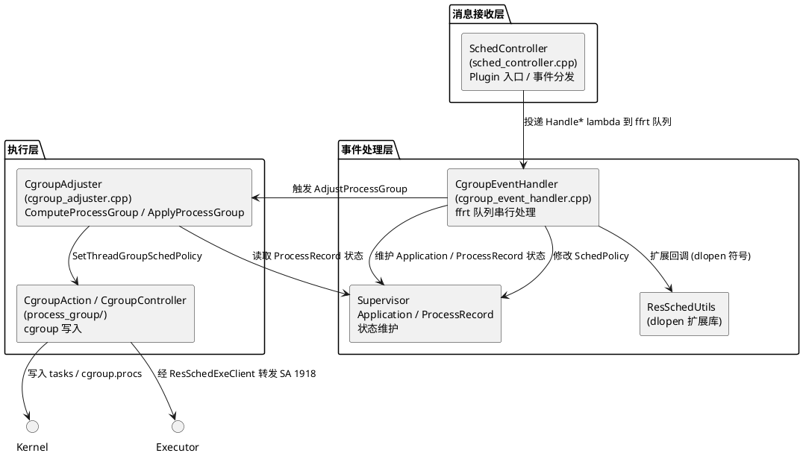

# 架构设计及约束

## 架构设计

### 设计原则

| 原则     | 描述                                                                       | 理由                                  |
| ------ | ------------------------------------------------------------------------ | ----------------------------------- |
| 三层分层架构 | 自上而下分为消息接收层、事件处理层、执行层，职责清晰单向依赖                                            | 各层可独立演进与测试，避免反向依赖与循环耦合              |
| 事件驱动决策 | 系统事件经 ffrt 队列串行处理，维护进程模型并触发策略重算                                      | 单队列串行保证进程模型一致性，避免锁竞争                |
| 策略与执行分离 | `CgroupAdjuster` 只计算 `SchedPolicy`，`process_group` 层负责落地                | 策略逻辑与 cgroup 文件系统操作解耦，可独立测试与演进      |
| 扩展机制   | 处理层通过 `ResSchedUtils` 以 dlopen 方式加载扩展动态库，回调上报、仲裁、事件分发等扩展能力              | 扩展能力与核心逻辑解耦，按产品形态差异化加载，缺失时安全降级       |

### 逻辑架构

架构分为三层，自上而下单向依赖，处理层另带一条 dlopen 扩展通道：

- **消息接收层（`sched_controller.cpp`）**：插件对 ressched 框架的入口。`SchedController` 实现 `Plugin` 基类，接收 `DispatchResource`/`DeliverResource` 调用，按 `resType` 查 `dispatchResFuncMap_` 命中 `Handle*` 处理函数并投递到下层 ffrt 队列；负责插件生命周期、事件订阅、自进程初始分组与 Dump 调试接口。
- **事件处理层（`cgroup_event_handler.cpp`）**：在单一 ffrt 队列 `CgroupEventHandlerQueue` 上串行执行各 `Handle*` 方法，解析 payload 并维护 `Supervisor` 中的 `Application` 与 `ProcessRecord` 结构体状态（焦点、可见性、瞬态任务、连续任务、音频、相机、运行锁等），随后修改进程的 `SchedPolicy` 并触发下层执行。
- **执行层（`cgroup_adjuster.cpp` + `process_group/`）**：`CgroupAdjuster::AdjustProcessGroup` 调用 `ComputeProcessGroup` 基于 `ProcessRecord` 计算 `SchedPolicy`，经 `ApplyProcessGroup` 下发到 `process_group` 层的 `CgroupAction`/`CgroupController` 完成内核 cgroup tasks/procs 写入或经 `ResSchedExeClient` 转发至 SA 1918。
- **扩展通道（`ResSchedUtils` dlopen）**：处理层在初始化与事件分发过程中，通过 `ResSchedUtils` 以 `dlopen`/`dlsym` 加载 `libresschedsvc.z.so` 与 `libcgroup_sched_ext.z.so`，获取上报、仲裁结果回报、系统事件回报、扩展分发、扩展资源订阅等函数指针并回调，符号缺失时安全返回。

### 非功能设计

| 场景类别     | 方案设计                                                                       |
| -------- | -------------------------------------------------------------------------- |
| 单队列串行化   | 所有事件处理与策略调整在 `CgroupEventHandlerQueue` 上串行执行，避免进程模型并发修改                    |
| fdsan 保护 | `/proc` 与 cgroup tasks/procs 文件描述符以 `SCHEDULE_CGROUP_FDSAN_TAG=0xd001702` 打标签 |

## 架构约束

- **分层依赖方向**
  - **what**：依赖方向严格自上而下：消息接收层（`sched_controller.cpp`）→ 事件处理层（`cgroup_event_handler.cpp`）→ 执行层（`cgroup_adjuster.cpp` + `process_group/`）；`ResSchedUtils` 作为处理层的 dlopen 扩展通道被回调；`process_group` 不依赖 `Supervisor`
  - **why**：违反会导致循环依赖与职责混乱，`process_group` 的可独立性将被破坏

- **进程模型单线程访问**
  - **what**：`Supervisor`/`Application`/`ProcessRecord` 状态变更必须在 `CgroupEventHandlerQueue` 队列任务内执行，禁止在调度层加锁或跨线程访问
  - **why**：单队列串行是进程模型一致性的唯一保障，锁竞争在高频事件场景下延迟不可控