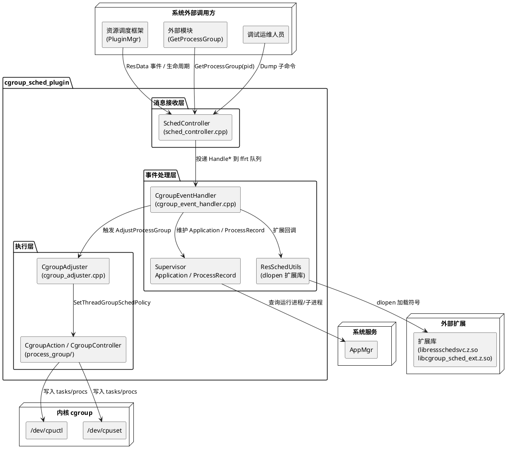

# 业务背景

## 应用定位

### 核心职责

本组件负责 **HarmonyOS 系统事件的感知、应用与进程运行态建模、进程分组调度策略决策与 cgroup 内核落地**，为资源调度子系统（ressched，SA 1901）提供进程级别的 cgroup 迁移执行能力。本组件以插件形式被资源调度框架加载，依据 Ability/窗口/进程/音频/摄像头/连续任务/瞬态任务/锁屏/系统负载等系统事件，动态计算每个进程应归属的调度策略组（默认/后台/前台/系统后台/顶级应用），并写入内核 cgroup 文件系统完成实际迁移。

### 职责边界（本组件不负责）

- 不负责资源事件的采集、权限白名单校验、插件加载与生命周期管理，由资源调度框架的 PluginMgr 与 ObserverManager 承担
- 不负责 SoC 性能调频、帧感知调度、socperf、frame_aware 等其他插件的策略决策
- 不负责 cgroup 文件系统挂载拓扑创建与配置文件生成，由 init 阶段与产品侧维护
- 不负责扩展库内部的上报、仲裁、事件分发、资源订阅具体业务实现，本组件仅加载扩展库符号并转发调用
- 不负责应用进程的启动、停止、调度优先级计算（仅依据上游事件维护进程模型并产出策略组）

## 系统上下文

## 核心输入

1. **资源调度框架事件**：异步资源事件（resType + value + payload），覆盖 36 类事件类型（Ability 状态、Extension 状态、进程创建/销毁/状态、应用状态、窗口焦点/可见性/绘制、瞬态任务、连续任务、音频播放/采集、Webview 音频/视频/录屏、屏幕录屏、键线程、窗口状态、RunningLock、SceneBoard、MMI、相机、Wi-Fi、蓝牙 A2DP、AV 编解码、Nap 模式、系统负载、屏幕锁定、开机完成、热状态、CosmicCube、应用停止、表单状态、系统 SA 状态、连续启动、Web 子窗任务等）
2. **同步资源事件**：携带应答对象的资源事件，由本组件转发至扩展库处理
3. **应用管理服务**：运行态进程列表与子进程列表，用于插件初始化时重建进程模型缓存

## 核心输出

1. **内核 cgroup 文件系统**：进程/线程写入 `/dev/cpuctl`、`/dev/cpuset` 控制器下 background、foreground、system-background、top-app 等子组
2. **进程内数据上报**：进程组调整事件（`RES_TYPE_CGROUP_ADJUSTER`），载荷包含 pid、uid、应用名、原组别、新组别
3. **仲裁结果上报**：经扩展库向资源调度服务回报每次策略调整的仲裁结果与触发来源
4. **系统事件（HiSysEvent）**：进程焦点、进程死亡、窗口绘制、音频、Webview 音频/视频/录屏、Web 子窗任务、运行锁、蓝牙连接、相机、Wi-Fi、MMI、Nap、AV 编解码等状态变更事件
5. **调试接口输出**：进程事件状态、进程窗口信息、进程运行锁信息、帮助说明
6. **链路追踪（HiTraceChain）**：进程组调整、能力状态变更、进程状态变更、窗口焦点等关键路径的 RAII 追踪链
