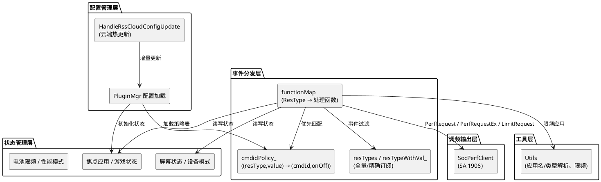

# 架构设计及约束

## 架构设计

### 设计原则

| 原则 | 描述 | 理由 |
| ---- | ---- | ---- |
| 事件驱动 | 以 functionMap 映射表驱动事件路由，处理逻辑与分发逻辑解耦 | 新增事件仅需注册映射条目，分发逻辑无需修改 |
| 配置驱动 | 调频策略参数由 PluginMgr 配置定义，支持云端热更新 | 策略调整无需重新编译，产品差异化快速响应 |

### 逻辑架构

### 非功能设计

| 场景类别 | 方案设计 |
| ---- | ---- |
| 连续拖拽节流 | 两次拖拽调频命令最小间隔 4500ms |
| 编译裁剪 | 通过特性宏控制功能编译路径，未开启特性的代码不编译 |
