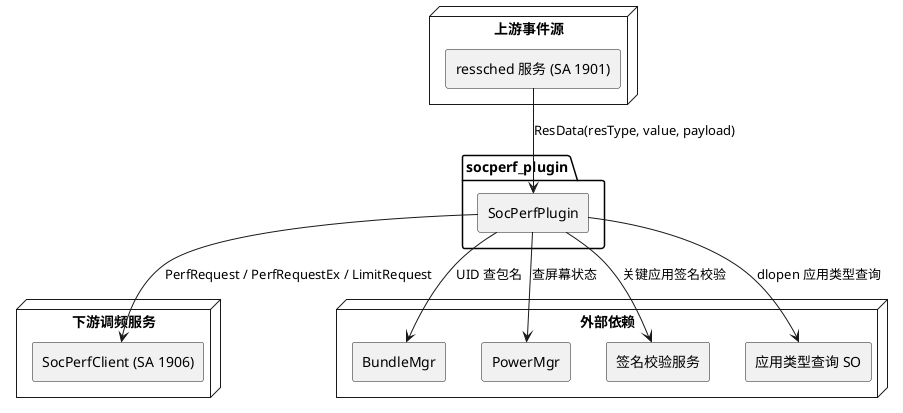

# 业务背景

## 应用定位

### 核心职责
本插件负责 **系统事件到 SoC 调频命令的转换与下发**，为 **ressched 服务（SA 1901）** 提供 **CPU/GPU/DDR 频率调节** 能力，是 **资源调度子系统** 中"事件 → 频率"策略执行层的关键组成部分。

### 职责边界（本插件不负责）
- 不处理系统事件的采集与上报，由 ressched 框架的 ObserverManager 承担
- 不负责事件白名单与权限控制，由 ressched 框架依据权限分层完成
- 不直接控制底层 SoC 频率寄存器，频率下发由 SocPerfClient（SA 1906）及其底层服务执行
- 不负责进程分组调度策略决策，由 cgroup_sched 插件承担
- 不负责帧感知调度与渲染管线优化，由 frame_aware_plugin 承担
- 不负责事件聚合为高层场景语义，由 SceneRecognizerMgr 场景识别层承担
- 不负责插件的加载、卸载生命周期管理与超时监控，由 ressched 框架的 PluginMgr 承担

## 系统上下文

