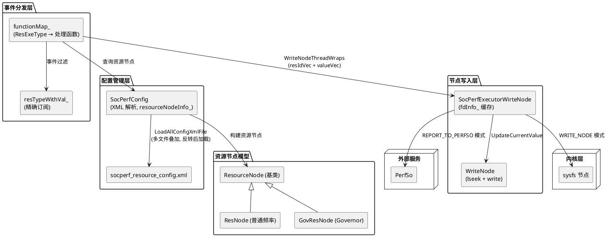

# 架构设计及约束

## 架构设计

### 设计原则

| 原则 | 描述 | 理由 |
| ---- | ---- | ---- |
| 事件驱动 | 以 functionMap_ 映射表驱动事件路由，处理逻辑与分发逻辑解耦 | 新增事件类型仅需注册映射条目 |
| XML 配置驱动 | 资源节点定义由 XML 配置文件声明，支持多文件叠加加载 | 产品差异化通过配置文件实现，无需修改代码 |
| fd 缓存复用 | 内核节点 fd 首次打开后缓存，后续写入仅 lseek+write | 避免频繁 open/close 系统调用开销 |

### 逻辑架构

### 非功能设计

| 场景类别 | 方案设计 |
| ---- | ---- |
| 安全加固 | CFI + cfi_cross_dso + PAC_RET + stack-protector-strong + RELRO/NOW |
| fd 安全 | fdsan 标签保护（SCHEDULE_CGROUP_FDSAN_TAG），析构时 fdsan_close_with_tag 释放 |
| 配置叠加 | GetCfgFiles 返回多配置文件链，反转后依次加载，先加载的配置若 ID 重复则跳过（`resourceNodeInfo_.find` 去重） |
| 路径安全 | realpath 校验配置文件路径和节点路径，防止符号链接攻击和路径越界 |
