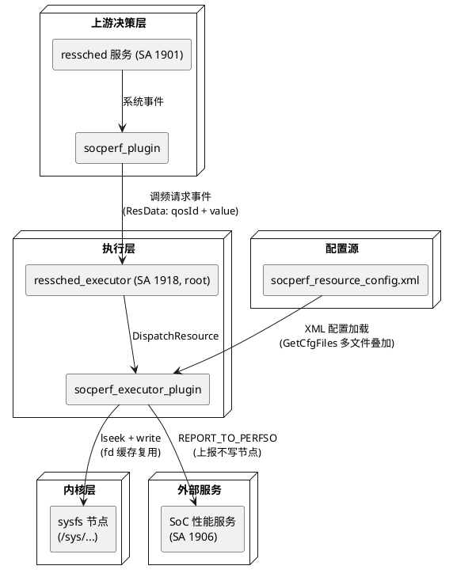

# 业务背景

## 应用定位

### 核心职责
本插件负责 **调频请求到内核 sysfs 节点的映射与写入**，为 **ressched_executor 服务（SA 1918，root 权限）** 提供 **直接控制 CPU/GPU/DDR 频率** 能力，是 **资源调度子系统** 双进程架构中"决策 → 执行"链路的执行层。

### 职责边界（本插件不负责）
- 不负责调频策略决策，由 ressched 服务（SA 1901）的 socperf_plugin 决策
- 不负责事件采集与上报，由 ressched_executor 框架接收
- 不负责插件加载/卸载/超时监控，由 ressched_executor 框架的 PluginMgr 承担
- 不负责 SoC 底层频率寄存器控制，频率写入通过内核 sysfs 节点完成
- 不直接接收上层应用或系统服务的调频请求，请求由 socperf_plugin 决策后通过事件下发

## 系统上下文

